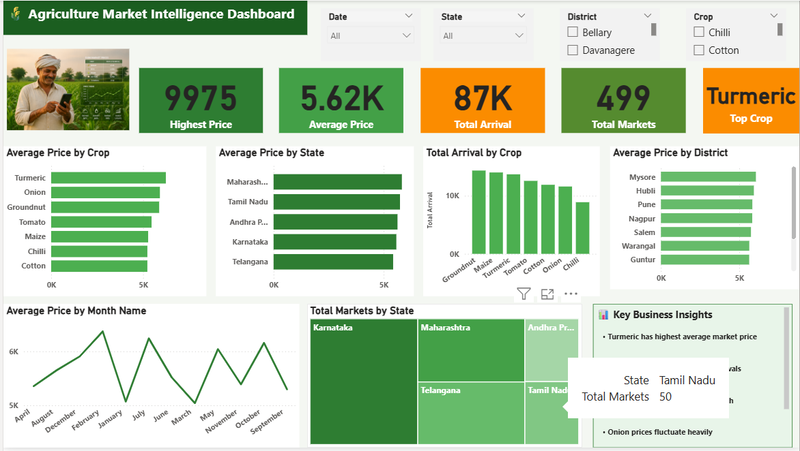

# 🌾 Agriculture Market Intelligence Dashboard

## 📌 Overview

This interactive Power BI dashboard provides insights into agricultural market trends, crop prices, arrivals, and market performance across different states and districts.

---

## 🛠️ Tools & Technologies

- Microsoft Power BI
- Power Query
- DAX
- Excel / CSV

---

## 📊 Dashboard Features

- Highest Market Price
- Average Price Analysis
- Total Arrival Analysis
- State-wise Market Analysis
- District-wise Price Comparison
- Crop-wise Arrival Analysis
- Monthly Price Trend
- Interactive Filters

---

## 📂 Dataset

- Agriculture_Market_Data.xlsx

---

## 🖼 Dashboard Preview

---

## 👨‍💻 Author

**Shivu GJ**
